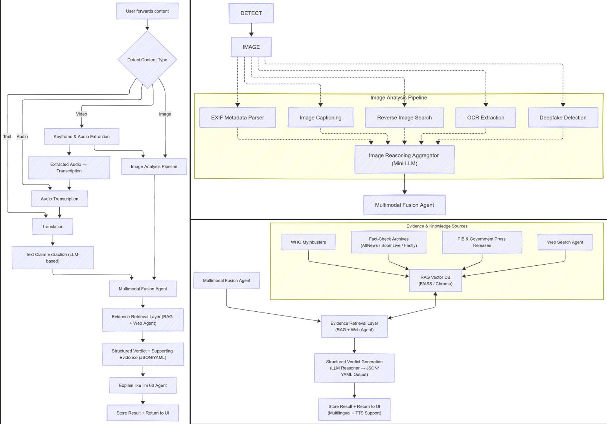

# 🛡️ VeritasAI - Multimodal Misinformation Detection System

[](https://www.python.org/downloads/)
[](https://opensource.org/licenses/MIT)
[](https://streamlit.io/)
[](https://langchain.com/)

A comprehensive AI-powered fact-checking system that analyzes **multimodal content** to detect misinformation using advanced LLMs, RAG (Retrieval-Augmented Generation), and computer vision techniques.


## Overview

**VeritasAI** is a state-of-the-art misinformation detection platform that combines multiple AI technologies to provide comprehensive fact-checking capabilities. The system can:

- ✅ **Analyze text claims** with multi-language support (90+ languages)
- ✅ **Detect image manipulations** including deepfakes and AI-generated content
- ✅ **Verify multimodal content** by cross-referencing text and images
- ✅ **Retrieve evidence** from local vector stores and web searches
- ✅ **Generate detailed verdicts** with confidence scores and explanations

### System Pipeline and Architecture



---

## Key Features

### 🔤 **Text Analysis Pipeline**
- **Multi-language Detection**: Automatic detection of 90+ languages
- **Claim Extraction**: AI-powered extraction of verifiable claims
- **Claim Fusion**: Intelligent merging of redundant claims
- **Evidence Retrieval**: Hybrid search combining local vector store (FAISS) and web search
- **LLM Reranking**: Advanced evidence ranking using Gemini 2.0

### 🖼️ **Image Analysis Pipeline**
- **EXIF Metadata Extraction**: Camera settings, GPS, timestamps
- **Reverse Image Search**: Find similar images across the web
- **Deepfake Detection**: AI-generated content identification
- **Manipulation Detection**: Edit analysis and authenticity scoring
- **Visual Evidence**: Comparison with similar images

### 🔀 **Multimodal Pipeline**
- **Cross-Modal Verification**: Text-image consistency checking
- **Context Analysis**: Relationship between claims and visuals
- **Comprehensive Verdicts**: Holistic misinformation assessment

### 🌐 **Web Interface**
- **Beautiful Streamlit UI**: Modern, responsive design
- **Real-time Analysis**: Live progress indicators
- **Export Options**: JSON and text report downloads
- **Interactive Results**: Expandable sections and detailed breakdowns

---

## Installation

### Prerequisites

- Python 3.10 or higher
- pip package manager
- Google Gemini API key ([Get one here](https://aistudio.google.com/app/apikey))

### Step 1: Clone Repository

```bash
git clone https://github.com/SingletLinkage/VeritasAI.git
cd VeritasAI
```

### Step 2: Install Dependencies

```bash
# Core dependencies
pip install -r requirements.txt

# Additional dependencies for retrieval system
pip install faiss-cpu langchain-community sentence-transformers
```

### Step 3: Environment Setup

Create a `.env` file in the project root:

```bash
# Required
GOOGLE_API_KEY=your_google_gemini_api_key_here

# Optional
SERPAPI_KEY=your_serpapi_key_here  # For real web search
ENABLE_RERANKING=false  # Set to true to enable LLM reranking
```

### Step 4: Populate Vector Store

```bash
cd backend
python3 populate_vector_store.py
```

This creates a local FAISS index with pre-seeded fact-checked claims.

---

## 🔧 System Components

### 1. **Text Pipeline** (`backend/text_pipeline.py`)

**Nodes:**
- `DetectLanguage`: Identifies input language using langdetect
- `Translation`: Translates non-English text to English
- `ClaimExtraction`: Extracts checkable claims using LLM
- `Fusion`: Merges redundant/similar claims
- `RetrieveEvidence`: Fetches supporting/contradicting evidence

**Technologies:** LangGraph, Gemini 2.5 Flash, langdetect

### 2. **Image Pipeline** (`backend/image_pipeline.py`)

**Nodes:**
- `EXIFExtraction`: Reads camera metadata
- `ReverseImageSearch`: Finds similar images (mock SerpAPI)
- `DeepfakeDetection`: Analyzes for AI-generated content
- `ManipulationAnalysis`: Detects editing artifacts
- `VerdictGeneration`: Aggregates findings

**Technologies:** PIL, exifread, LLM-based analysis

### 3. **Multimodal Pipeline** (`backend/multimodal_pipeline.py`)

Combines text and image pipelines with cross-modal verification.

### 4. **Hybrid Evidence Retrieval** (`backend/hybrid_retrieval.py`)

**Components:**
- **Vector Store Manager** (`vector_store.py`): FAISS-based local search
- **Web Search Agent** (`web_search.py`): Mock SerpAPI integration
- **Evidence Reranker** (`reranker.py`): LLM-based relevance scoring

**Features:**
- Deduplication of evidence
- Configurable search parameters
- Metadata tracking (source, URL, scores)

### 5. **Frontend** (`frontend/app.py`)

Beautiful Streamlit interface with:
- Three analysis modes (Text, Image, Multimodal)
- Real-time progress indicators
- Export functionality (JSON, TXT)
- Responsive design

---

## 📁 Project Structure

```
veritasai/
├── README.md                         # Main documentation
├── requirements.txt                  # Python dependencies
├── .env                              # Environment variables (create this)
│
├── backend/                          # Core system
│   ├── text_pipeline.py              # Text analysis pipeline
│   ├── image_pipeline.py             # Image analysis pipeline
│   ├── multimodal_pipeline.py        # Combined analysis
│   │
│   ├── hybrid_retrieval.py           # Main retrieval orchestrator
│   ├── vector_store.py               # FAISS vector store manager
│   ├── web_search.py                 # Web search agent
│   ├── reranker.py                   # LLM-based evidence ranking
│   │
│   ├── models.py                     # Pydantic models (text/fusion)
│   ├── retrieval_models.py           # Pydantic models (evidence)
│   ├── prompts.py                    # LLM prompts
│   │
│   ├── exif_tool.py                  # EXIF metadata extraction
│   ├── ocr_tool.py                   # OCR for images
│   ├── rev_search_tool.py            # Reverse image search
│   │
│   ├── populate_vector_store.py      # Data population script
│   ├── visualize_pipeline.py         # Generate pipeline diagrams
│   │
│   │
│   └── data/                         # [imp] Not in GitHub Repo
│       └── vector_store/             # FAISS index storage
│           ├── index.faiss           # Vector index
│           └── index.pkl             # Metadata
│
├── frontend/                         # Web interface
│   ├── app.py                        # Streamlit application
│   ├── test_frontend.py              # Frontend tests
│   ├── requirements.txt              # Frontend dependencies
│
│
└── data/                             # Shared data directory
    └── vector_store/                 # Alternative vector store location
```

---

## 🛠️ Technologies Used

### **AI & Machine Learning**
- **Google Gemini 2.0 Flash**: Primary LLM for analysis and generation
- **LangChain**: LLM orchestration and chaining
- **LangGraph**: State machine for pipeline workflows
- **FAISS**: Vector similarity search
- **Sentence Transformers**: Text embeddings (all-MiniLM-L6-v2)

### **Computer Vision**
- **PIL (Pillow)**: Image processing
- **exifread**: EXIF metadata extraction
- **LLM-based Vision**: Gemini Pro Vision for image analysis

### **Natural Language Processing**
- **langdetect**: Language identification
- **Pydantic**: Data validation and serialization

### **Web & APIs**
- **Streamlit**: Web interface
- **SerpAPI** (Mock): Web search integration
- **Google Generative AI**: Embeddings and chat

### **Data & Storage**
- **FAISS**: Vector database
- **Python pickle**: Metadata persistence
- **JSON**: Data interchange

--- 

## Team Members
- Arka Mukhopadhyay
- Paridhi Mittal
- Piyush Dwivedi
- Yug Goyal

## License
This project was created as part of the IIT Mandi iHub Multimodality Hackathon.