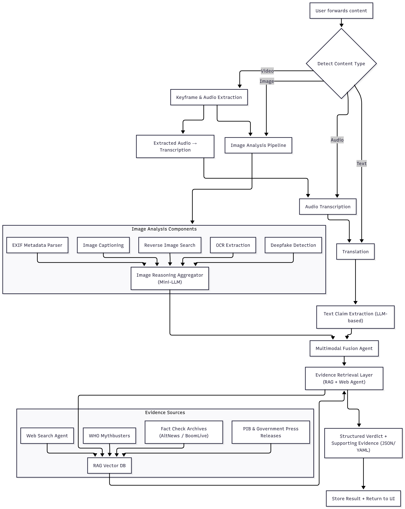

# 🛡️ VeritasAI - Multimodal Misinformation Detection System

[](https://www.python.org/downloads/)
[](https://opensource.org/licenses/MIT)
[](https://streamlit.io/)
[](https://langchain.com/)

A comprehensive AI-powered fact-checking system that analyzes **multimodal content** to detect misinformation using advanced LLMs, RAG (Retrieval-Augmented Generation), and computer vision techniques.


## Overview

**VeritasAI** is a state-of-the-art misinformation detection platform that combines multiple AI technologies to provide comprehensive fact-checking capabilities. The system can:

- ✅ **Analyze text claims** with multi-language support (90+ languages)
- ✅ **Transcribe and verify audio content** using OpenAI Whisper
- ✅ **Detect image manipulations** including deepfakes and AI-generated content
- ✅ **Verify multimodal content** by cross-referencing text and images
- ✅ **Retrieve evidence** from local vector stores and web searches
- ✅ **Generate detailed verdicts** with confidence scores and explanations

### System Pipeline and Architecture



---

## Key Features

### 🔤 **Text Analysis Pipeline**
- **Multi-language Detection**: Automatic detection of 90+ languages
- **Claim Extraction**: AI-powered extraction of verifiable claims
- **Claim Fusion**: Intelligent merging of redundant claims
- **Evidence Retrieval**: Hybrid search combining local vector store (FAISS) and real web search
- **LLM Reranking**: Advanced evidence ranking using Gemini 2.0 Flash Lite

### 🎤 **Audio Analysis Pipeline**
- **Speech-to-Text**: Automatic transcription using OpenAI Whisper
- **Multi-language Support**: Supports 90+ languages in audio
- **Claim Analysis**: Transcribed audio analyzed through text pipeline
- **Evidence Retrieval**: Full fact-checking on spoken claims

### 🖼️ **Image Analysis Pipeline**
- **EXIF Metadata Extraction**: Camera settings, GPS, timestamps
- **Reverse Image Search**: Find similar images across the web using real SerpAPI
- **Deepfake Detection**: AI-generated content identification
- **Manipulation Detection**: Edit analysis and authenticity scoring
- **Visual Evidence**: Comparison with similar images

### 🔀 **Multimodal Pipeline**
- **Cross-Modal Verification**: Text-image consistency checking
- **Context Analysis**: Relationship between claims and visuals
- **Comprehensive Verdicts**: Holistic misinformation assessment

### 👵👴 **Explainability & Accessibility ("Explain Like I'm 60")**
- **Simple Language**: Grade-5 reading level explanations for all verdicts
- **Respectful Tone**: Culturally appropriate greetings (Uncle/Aunty)
- **Clear Actions**: Easy-to-follow steps for what to do
- **Multi-language**: Explanations in user's native language
- **Accessibility**: Makes fact-checking understandable for users 60+ with limited digital literacy

### 🌐 **Web Interface**
- **Beautiful Streamlit UI**: Modern, responsive design
- **Four Analysis Modes**: Text Only, Text + Image, Image Only, Audio Only
- **Real-time Analysis**: Live progress indicators
- **Export Options**: JSON and text report downloads
- **Interactive Results**: Expandable sections and detailed breakdowns
- **Dual Explanations**: Technical + Simple explanations for every verdict

---

## Installation

### Prerequisites

- Python 3.10 or higher
- pip package manager
- Google Gemini API key ([Get one here](https://aistudio.google.com/app/apikey))

### Step 1: Clone Repository

```bash
git clone https://github.com/SingletLinkage/VeritasAI.git
cd VeritasAI
```

### Step 2: Install Dependencies

```bash
# Core dependencies
pip install -r requirements.txt
```

### Step 3: Environment Setup

Create a `.env` file in the **project root directory**:

```bash
# Required
GOOGLE_API_KEY=your_google_gemini_api_key_here

# Required for image reverse search
SERPAPI_API_KEY=your_serpapi_key_here
```

**Getting API Keys:**
- **Google Gemini API**: Get your free API key at [Google AI Studio](https://aistudio.google.com/app/apikey)
- **SerpAPI**: Sign up for free tier at [SerpAPI](https://serpapi.com/) (100 searches/month free)

### Step 4: Populate Vector Store

```bash
cd backend
python3 populate_vector_store.py
```

This populates a local FAISS index with **real scraped fact-checking data** from:
- **WHO (World Health Organization)** - 21 health myth-busting articles
- **FactCheck.org** - 10 general fact-check articles
- **PTI Fact Check** - 20 political and news fact-checks
- **Reserve Bank of India** - 133 financial fraud alerts

---

## 🔧 System Components

### 1. **Text Pipeline** (`backend/text_pipeline.py`)

**Nodes:**
- `DetectLanguage`: Identifies input language using langdetect
- `Translation`: Translates non-English text to English
- `ClaimExtraction`: Extracts checkable claims using LLM
- `Fusion`: Merges redundant/similar claims
- `RetrieveEvidence`: Fetches supporting/contradicting evidence

**Technologies:** LangGraph, Gemini 2.5 Flash, langdetect

### 2. **Audio Pipeline** (`backend/audio_pipeline.py`)

**Nodes:**
- `TranscribeAudio`: Converts speech to text using OpenAI Whisper
- `AnalyzeClaims`: Runs transcribed text through text pipeline

**Technologies:** OpenAI Whisper, LangGraph, integrates with text pipeline

**Features:**
- Automatic language detection in audio
- Support for multiple audio formats (mp3, wav, m4a, etc.)
- Configurable Whisper model size (tiny to large)
- Full claim extraction and evidence retrieval on transcribed content

### 3. **Image Pipeline** (`backend/image_pipeline.py`)

**Nodes:**
- `EXIFExtraction`: Reads camera metadata
- `ReverseImageSearch`: Finds similar images using real SerpAPI
- `DeepfakeDetection`: Analyzes for AI-generated content
- `ManipulationAnalysis`: Detects editing artifacts
- `VerdictGeneration`: Aggregates findings

**Technologies:** PIL, exifread, SerpAPI, LLM-based analysis

### 4. **Multimodal Pipeline** (`backend/multimodal_pipeline.py`)

Combines text and image pipelines with cross-modal verification.

### 5. **Hybrid Evidence Retrieval** (`backend/hybrid_retrieval.py`)

**Components:**
- **Vector Store Manager** (`vector_store.py`): FAISS-based local search
- **Web Search Agent** (`web_search.py`): Real SerpAPI integration for web evidence
- **Evidence Reranker** (`reranker.py`): LLM-based relevance scoring

**Features:**
- Deduplication of evidence
- Configurable search parameters
- Metadata tracking (source, URL, scores)
- Combines local knowledge base with real-time web search

### 6. **Frontend** (`frontend/app.py`)

Beautiful Streamlit interface with:
- Four analysis modes (Text Only, Text + Image, Image Only, Audio Only)
- Real-time progress indicators
- Audio file upload and transcription
- Export functionality (JSON, TXT)
- Responsive design with custom CSS styling

---

## 📁 Project Structure

```
ihub/
├── README.md                         # Main documentation
├── requirements.txt                  # Python dependencies
├── pipeline.jpg                      # System architecture diagram
│
├── backend/                          # Core system
│   ├── .env                          # Environment variables
│   │
│   ├── text_pipeline.py              # Text analysis pipeline
│   ├── audio_pipeline.py             # Audio analysis pipeline
│   ├── image_pipeline.py             # Image analysis pipeline
│   ├── multimodal_pipeline.py        # Combined analysis
│   │
│   ├── hybrid_retrieval.py           # Main retrieval orchestrator
│   ├── vector_store.py               # FAISS vector store manager
│   ├── web_search.py                 # Real SerpAPI web search
│   ├── reranker.py                   # LLM-based evidence ranking
│   │
│   ├── models.py                     # Pydantic models (text/fusion)
│   ├── retrieval_models.py           # Pydantic models (evidence)
│   ├── prompts.py                    # LLM prompts
│   │
│   ├── exif_tool.py                  # EXIF metadata extraction
│   ├── ocr_tool.py                   # OCR for images
│   ├── rev_search_tool.py            # Reverse image search
│   │
│   ├── populate_vector_store.py      # Data population script
│   ├── visualize_pipeline.py         # Generate pipeline diagrams
│   │
│   ├── web_scrappers/                # Scraped fact-checking data
│   │   ├── who_scrapper.py           # WHO scraper script
│   │   ├── fact_check_scraper.py     # FactCheck.org scraper
│   │   ├── pti_html_parser.py        # PTI parser script
│   │   └── rbi_scrapper.py           # RBI scraper script
│   │
│   └── data/                         # Data storage
│       └── vector_store/             # FAISS index storage
│           ├── index.faiss           # Vector index (generated)
│           └── index.pkl             # Metadata (generated)
│
└── frontend/                         # Web interface
    ├── app.py                        # Streamlit application
    └── requirements.txt              # Frontend dependencies

```
---

## 🛠️ Technologies Used

### **AI & Machine Learning**
- **Google Gemini 2.5 Flash**: Primary LLM for analysis and generation
- **LangChain**: LLM orchestration and chaining
- **LangGraph**: State machine for pipeline workflows
- **FAISS**: Vector similarity search
- **Sentence Transformers**: Text embeddings (all-MiniLM-L6-v2)

### **Computer Vision**
- **PIL (Pillow)**: Image processing
- **exifread**: EXIF metadata extraction
- **LLM-based Vision**: Gemini Pro Vision for image analysis

### **Audio Processing**
- **OpenAI Whisper**: Speech-to-text transcription
- **PyTorch**: Deep learning framework for Whisper

### **Natural Language Processing**
- **langdetect**: Language identification
- **Pydantic**: Data validation and serialization

### **Web & APIs**
- **Streamlit**: Web interface
- **SerpAPI**: Real web search integration for evidence retrieval
- **Google Generative AI**: Embeddings and chat

### **Data & Storage**
- **FAISS**: Vector database
- **Python pickle**: Metadata persistence
- **JSON**: Data interchange

### **Data Sources** (for Vector Store)
- **WHO Myth Busters**: Health misinformation database
- **FactCheck.org**: General fact-checking articles
- **PTI Fact Check**: Indian news and political fact-checks
- **Reserve Bank of India**: Financial fraud and scam alerts

---

## 🚀 Running the Application

```bash
# Make sure you're in the project root directory
cd /path/to/directory

# Run the Streamlit app
streamlit run frontend/app.py
```

The app will open in your browser at `http://localhost:8501`

**Features:**
- 📝 **Text Only**: Analyze text claims
- 🎤 **Audio Only**: Upload and transcribe audio files (MP3, WAV, M4A, OGG, FLAC)
- 🖼️ **Image Only**: Analyze images for manipulation
- 🔀 **Text + Image**: Combined multimodal analysis

---

## 🎯 Key Capabilities

### Evidence Retrieval Strategy

1. **Vector Store Search** (Local FAISS)
   - Fast semantic similarity search
   - 192 curated fact-checking documents
   - Offline capability

2. **Web Search** (SerpAPI)
   - Real-time evidence from the web
   - Access to latest information
   - Broader coverage

3. **Hybrid Approach**
   - Combines both sources
   - Deduplicates results
   - Ranks by relevance

4. **LLM Reranking**
   - Uses Gemini 2.0 Flash Lite
   - Contextual relevance scoring
   - Improves evidence quality

### Multi-language Support

The system automatically detects and handles 90+ languages including:
- English, Hindi, Spanish, French, German
- Arabic, Chinese, Japanese, Korean
- Portuguese, Russian, Italian, Dutch
- And many more...

Non-English content is automatically translated to English for claim analysis.

--- 

## Team Members
- Arka Mukhopadhyay
- Paridhi Mittal
- Piyush Dwivedi
- Yug Goyal

## License
This project was created as part of the IIT Mandi iHub Multimodality Hackathon.